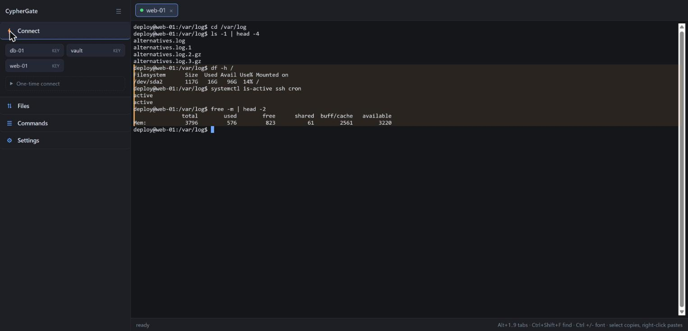
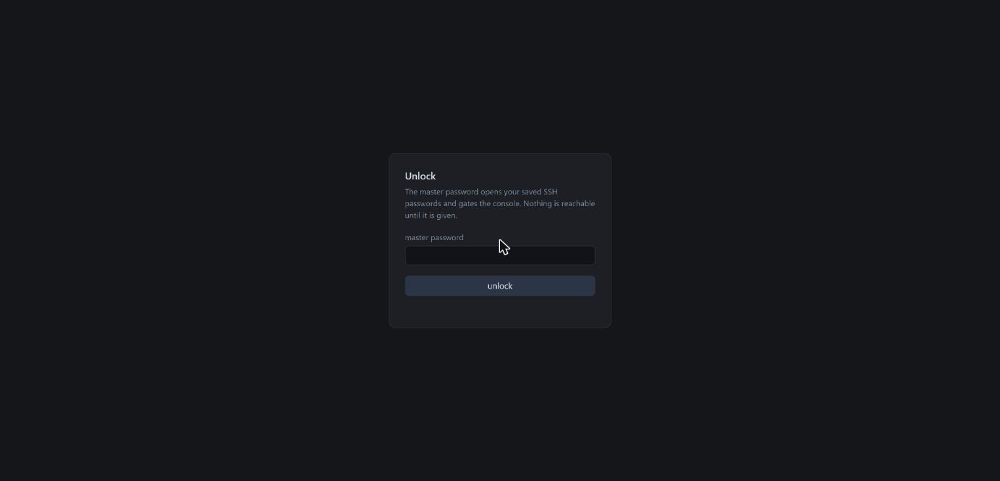
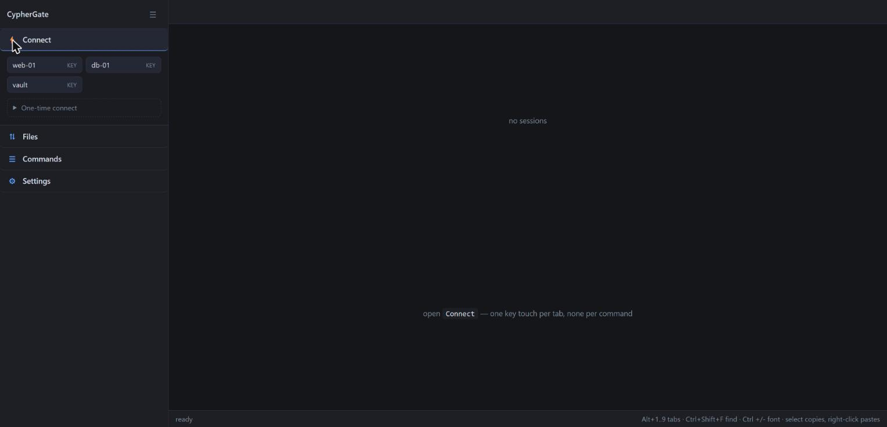
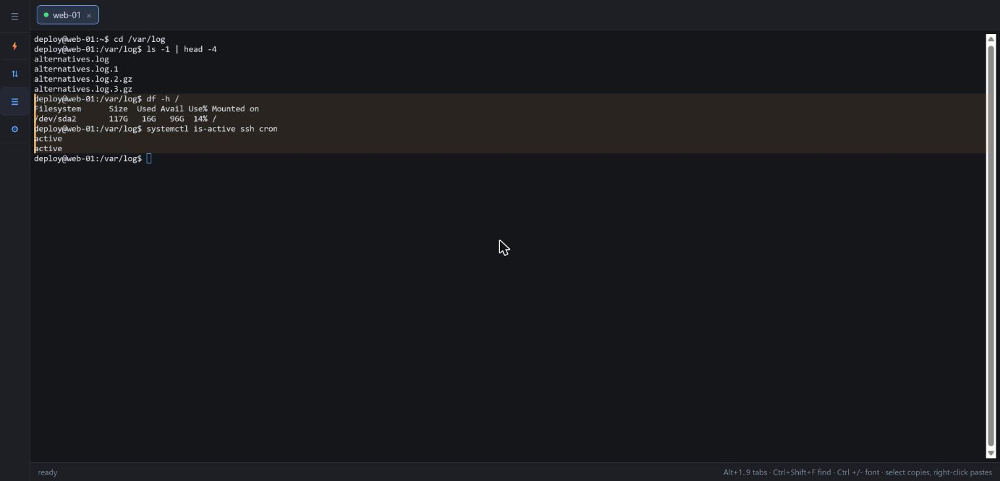
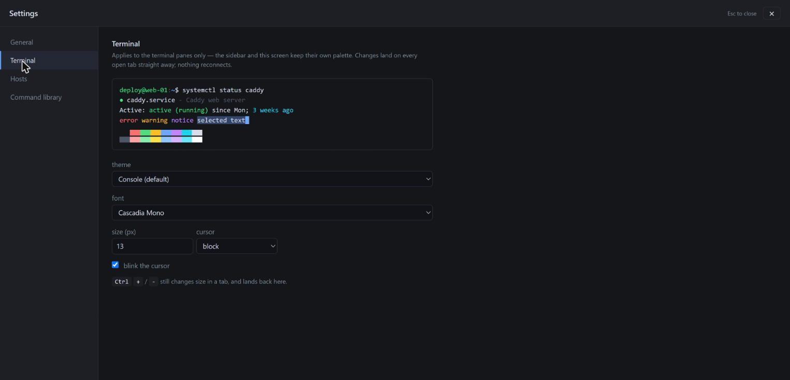
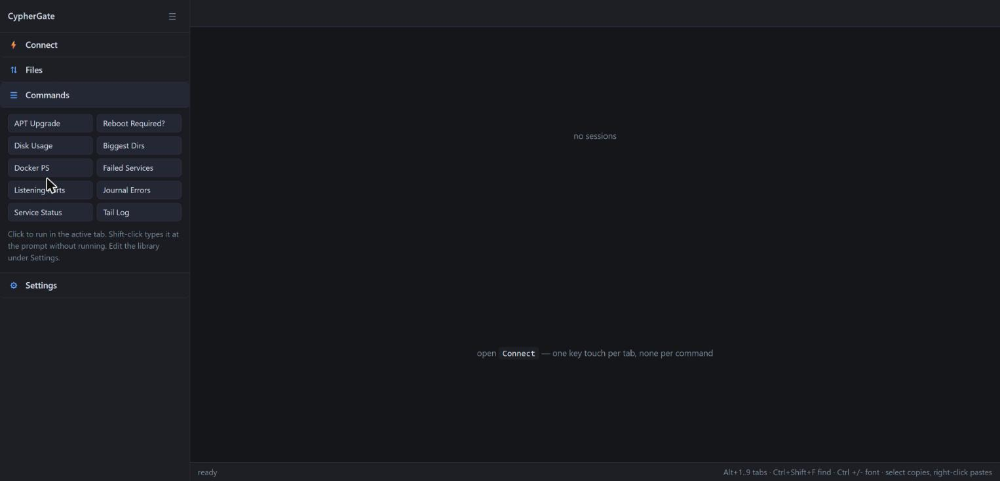
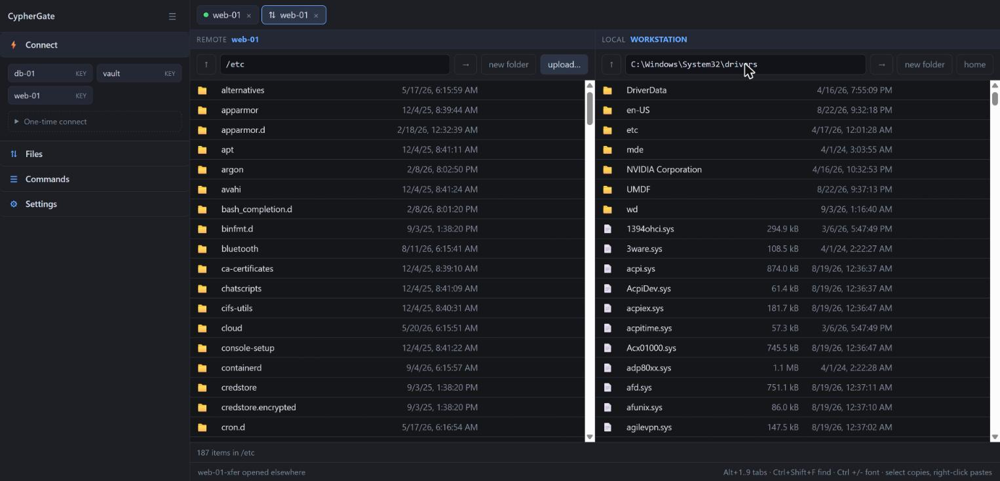
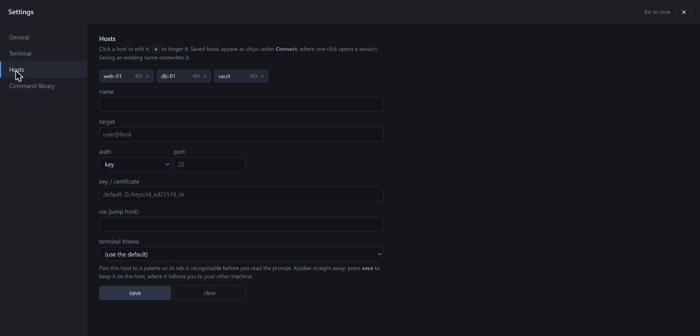

# CypherGate

**A tabbed SSH console you drive in the browser — with an HTTP API that lets a
script or an AI agent work in the *same* live session, while your keys stay
behind the gate.**

Your credentials never cross the API. A caller gets a session name and a
loopback token; it never sees a private key, a passphrase, or a password, and
it cannot unlock the vault that holds them. Authentication happens inside the
SSH client, where it belongs.



```
git clone https://github.com/jdwaymire/CypherGate.git
cd CypherGate
start.cmd
```

Windows. No Python to install, no OpenSSH to install, no admin rights, no
`pip install`. The interpreter and the SSH client travel in the folder.

---

## Contents

- [Why this exists](#why-this-exists)
- [The credential boundary](#the-credential-boundary)
- [Who this is for](#who-this-is-for)
- [Quick start](#quick-start)
- [The interface](#the-interface)
- [Automation and the API](#automation-and-the-api)
- [Security model](#security-model)
- [Vendored runtimes](#vendored-runtimes)
- [License](#license)

---

## Why this exists

Three problems, one design.

### 1. A hardware key charges a touch per connection

If your SSH key is a touch-required FIDO2 token — a YubiKey, a Nitrokey, a
Solo — every new connection makes it blink and waits for your finger. Drive SSH
the obvious way, one `ssh host command` per step, and a ten-step runbook costs
ten taps.

The usual answer is OpenSSH connection multiplexing (`ControlMaster`).
**On Windows it does not work** — the socket layer underneath it is not
implemented in the Win32 port. With `-M` the client fails instantly with
`getsockname failed: Not a socket`, before it reaches the network at all; the
options parse and the `mux_client` symbols are in the binary, but the socket
layer beneath them is not there.

So CypherGate holds the connection itself. **One touch per session, then
nothing** — not for the second command, not for the two-hundredth, and not for
file transfers, which ride the connection you already paid for.

### 2. Automating SSH usually means handing your credentials to the automation

Write a script that SSHes somewhere and you now have a credential-handling
problem you did not ask for. The script needs a key, so it gets a copy of one —
often a passphrase-less one, because a script cannot type a passphrase. Or it
gets a password, so the password lands in an environment variable, a config
file, or a CI secret store, and from there into a process list, a log, a crash
dump, or a screenshot.

Add an AI agent and it gets worse: whatever the agent can read, it can also
repeat — into a prompt, a tool call, or a transcript that gets pasted into a
bug report.

CypherGate inverts that. **The automation never receives a credential, because
the credential never leaves the client.** See
[The credential boundary](#the-credential-boundary).

### 3. Watching automation work is normally impossible

Run a script over SSH and you see its output when it finishes. Run an agent and
you read a summary of what it claims it did. Neither lets you *watch*, and
neither lets you intervene mid-way without killing the job.

Here, the browser and the API are attached to the same pty. What a caller runs
appears in your terminal keystroke by keystroke, and you can type into the same
shell at any moment — hit Ctrl-C, take over, hand it back. **Anything the API
sent is marked**, on screen and in the transcript, so it is never ambiguous who
ran what.

---

## The credential boundary

This is the part worth understanding, and it holds whether the thing calling
the API is an AI agent, a Python script, a cron job, or a colleague's `curl`.

**What lives inside CypherGate and never comes out:**

| Secret | Where it lives | Can an API caller read it? |
|---|---|---|
| SSH private key | On the FIDO2 token; never on disk at all | **No** — the key material physically cannot leave the token |
| Key passphrase / agent | Handled by the bundled `ssh` client | **No** |
| Saved SSH passwords | `secrets.enc`, AES-256-GCM under the master password | **No** — no route returns them |
| Master password | Typed by a human in the browser; held in server memory | **No** — no route reveals it, and none sets it but the unlock screen |

**What an API caller actually holds:** a loopback token, and the name of a
session someone already opened. That is the entire surface.

The practical consequence is the point:

> An agent that is compromised, prompt-injected, misconfigured, or simply
> mistaken **cannot exfiltrate your SSH credentials, because it was never given
> any.** It can run commands in a session while that session is open, and that
> is all.

Compare the alternatives it replaces:

| Approach | What the automation holds | If it leaks |
|---|---|---|
| Give the agent a private key | A reusable credential for every host that trusts it | Permanent compromise until you rotate everywhere |
| Password in env / config / CI secret | A reusable credential, plaintext at the point of use | Permanent compromise until you rotate |
| Agent drives an SSH library itself | Key *and* the code path that uses it | Both, plus a much larger attack surface |
| **CypherGate** | A loopback token, revoked when the server stops | Command execution while sessions are open; **no credential to steal** |

### What this is not

Being honest about the shape of the boundary matters more than making it sound
bigger than it is:

- **It is not an authority boundary.** Anything holding the token can run
  commands as you on every currently-open session. If your agent runs
  `rm -rf`, CypherGate will type it faithfully. The gate protects your
  *credentials*, not your *filesystems* — for the latter, watch the terminal,
  which is exactly why the terminal is right there.
- **It is not a sandbox.** There is no allowlist of permitted commands. That is
  a deliberate omission: a command allowlist that can be worked around is worse
  than none, because it invites trust it cannot carry.
- **It does not defend against someone already running code as you.** The token
  is a file on your disk while the server runs. Loopback plus that token is the
  whole boundary. What it defends is the folder *at rest* — synced, backed up,
  sitting on your other laptop — which contains no usable credential at all.
- **The blast radius is bounded by what is open.** A caller cannot unlock a
  locked server: it answers `423` on every route and writes no token until a
  human types the master password in a browser. So the worst an unattended
  compromise reaches is the sessions you left open, not your host inventory.

---

## Who this is for

The agent story is one use case. It is not the only one, and it is not even the
oldest — the touch-economics problem came first.

### Anyone with a touch-required hardware key

If you carry a YubiKey and administer more than two machines, you already know
the tax: tap, tap, tap. A long-lived session per host removes it entirely. Open
six tabs in the morning, pay six taps, and work all day.

### Runbooks and scheduled operations without a credential handout

A monthly patch run, a certificate rotation, a log sweep across twelve hosts.
The classic implementation gives a service account a passphrase-less key. The
CypherGate implementation opens the sessions with your hardware key, then lets a
plain shell script drive them over `/batch` — with no credential in the script,
nothing to rotate if the script leaks, and a transcript of exactly what ran.

### Portable administration

Everything is inside the folder: interpreter, SSH client, terminal emulator,
your host list, your encrypted passwords. Nothing is written to the registry,
`%LOCALAPPDATA%`, or anywhere outside it. Put it on a USB stick or a synced
folder and it is complete on the next machine — including a locked-down one
where you cannot install software. `secrets.enc` is portable *by design*: it
opens on any machine given the master password, which is precisely what a
machine-bound scheme like DPAPI could not do.

### Paired work, handover, and training

Two people and one screen is a video call. Two people and a shared session is
this. Because the browser and the API attach to the same pty, a session can be
watched while it is driven — useful for teaching a runbook, for supervising
someone's first production change, or for reviewing what an automation is about
to do to a database before it does it.

### Change windows that need an audit trail

Every session streams an ANSI-stripped transcript, and anything the API ran is
delimited in it:

```
--- api 2026-09-03 14:07:53 ---
deploy@web-01:/var/log $ systemctl restart nginx
--- end api ---
```

`grep -n '^--- api' web-01.log` lists every automated action in order, so "was
that us or the script?" has an answer rather than a debate.

### File transfer that costs no extra credential path

Copying files usually means a second tool with its own authentication — an SCP
invocation, an SFTP client with a saved profile, a GUI client storing your key
path. Here it is the connection you already have. Transfers ride the open
session in-band at no additional touch, or a dedicated transfer tab gives you a
two-pane browser at the cost of one.

### And yes — AI agents

Everything above is why the agent case works at all. An agent gets a session
name, not a key; every command it runs is on your screen as it happens and
marked as its own; you can Ctrl-C it mid-command; and when you close the tab,
its access is gone. That is a considerably better arrangement than handing a
model an SSH key and reading its summary afterwards.

The repository includes [`AGENTS.md`](AGENTS.md), a briefing written *for* the
agent — how to reuse sessions rather than opening them, why it must never ask
for a restart casually, and how to recognise each failure mode.

---

## Quick start

**Requirements:** Windows 10 or 11. That is the list.

```
git clone https://github.com/jdwaymire/CypherGate.git
cd CypherGate
start.cmd
```

`start.cmd` runs the bundled interpreter, checks that both bundles are present,
binds `http://127.0.0.1:8765`, and opens your browser there.

1. **Set a master password.** First run asks you to choose one, twice, minimum
   eight characters. It seals `secrets.enc` and gates the whole console.
   **There is no recovery** — that is what makes it worth having.

   

2. **Add a host.** Copy `hosts.example.json` to `hosts.json` and edit it, or add
   hosts from **Settings → Hosts** in the UI.

3. **Point at your key.** **Settings → General** sets `default_key`. Paths are
   expanded, so `%USERPROFILE%/.ssh/id_ed25519_sk` resolves correctly on every
   machine and one shared value works everywhere. `~` works too.

4. **Connect.** Open **Connect** in the sidebar and click a host chip. Touch
   your key once. You have a terminal.

Change the port with `CYPHERGATE_PORT` if 8765 is taken. Only one copy can
hold a port: a second one refuses to start with `cannot listen on
127.0.0.1:8765`, rather than quietly sharing it with the first.

### Keyboard

| Shortcut | Does |
|---|---|
| `Alt`+`1`…`9` | switch tabs |
| `Ctrl`+`Shift`+`F` | find in scrollback (`Enter` / `Shift+Enter` to cycle) |
| `Ctrl`+`+` / `-` / `0` | font size, remembered per browser |
| select text | copies |
| right-click | pastes |
| `Ctrl`+`C` | copies when text is selected, otherwise reaches the shell as SIGINT |
| `↻` on a dead tab | reconnect with the same settings |
| `Esc` | close the settings screen, hand the keyboard back to the terminal |

---

## The interface

### Saved hosts

Host chips under **Connect**. Click one and it opens with the target, auth
method, key, certificate, port and jump host from its entry — so day-to-day
connecting is one click and one touch. A host you have not saved goes through
**One-time connect**, folded away because it is the rare case.



An empty key field means *use the default key*, shown as placeholder text so a
blank box is not mistaken for an unset one. Leaving hosts blank means changing
the default in Settings moves all of them at once.

### Sessions are shared, and marked

An agent's commands are typed into the same pty you type into, and echoed the
same way. If you are mid-word when one arrives, the two interleave — which has
twice been mistaken for terminal corruption.

So **anything the API ran gets an ochre bar** behind the command *and its
output*, because the whole exchange came from the API, not just the line you can
see it typed on:



**You are never marked.** You are the default; the automation is the surprising
one, and a stripe on every line would carry no signal at all. There is nothing
to switch on and no way to switch it off — `/input` is treated as coming from
the API *unless it says otherwise*, so a caller cannot go unmarked by forgetting
a field.

### Terminal themes, and per-host colours

Eight themes ship — Console, Solarized Dark, Solarized Light, Gruvbox Dark,
Nord, Retro green, Retro amber, Dracula — each carrying the full 16-colour ANSI
set, so `ls`, `systemctl` and coloured prompts all render correctly.



**A host can pin its own theme**, and this is a safety feature wearing a
cosmetic hat. The classic SSH accident is the right command in the wrong window.
A colour that is wrong *before* you press Enter is a guard against it, so
production can be amber and staging can be Nord, on every machine you sync to.
Restyling applies instantly to open tabs and reconnects nothing, so it costs no
key touch.

### The command library

Click to run in the active tab, shift-click to type without running.
`{{name}}` placeholders prompt for a value first, so
`systemctl status {{service}} --no-pager` is one entry rather than ten.



Editing lives under **Settings → Command library**, deliberately away from the
buttons you press every day.

### Transfer tabs

The sidebar's **Files** section opens a `⇅ host` tab: a second connection
speaking the SFTP protocol, so it costs **one touch for the tab**, not one per
file. Browse, download, upload, rename and delete as much as you like until you
close it — the shell tab stays fully usable throughout.



Remote on the left, **this machine on the right**, the arrangement every other
file-transfer program settled on. Hover a row and one arrow copies it to the
other side's current directory; directories go whole.

The local pane is served by the server, not read by the browser — *a web page
cannot enumerate the disk it is running on.* Since the server already knows both
ends, copies go **disk → ssh → remote** without passing through the page: no
size ceiling, and roughly twice the throughput of the in-page path.

A download lands as `name.part` and is renamed into place, so an interrupted
copy never leaves a half file wearing the real name. **Delete asks first**, and
there is deliberately **no recursive delete** — directories go through `RMDIR`,
which fails on a non-empty one, so a mis-click cannot take a tree with it.

### Settings

A full screen rather than a sidebar strip, with a group per category:
**General**, **Terminal**, **Hosts**, **Command library**.



---

## Automation and the API

Base `http://127.0.0.1:8765`. Every `/api/*` call needs an `X-Token` header,
read from `state/<COMPUTERNAME>/token` — a file written **only after** the
master password is accepted, and deleted when the server exits.

```bash
TOKEN=$(cat "state/$COMPUTERNAME/token")
B=http://127.0.0.1:8765

# What is already open? Reuse it -- opening a session costs a key touch.
curl -s -H "X-Token: $TOKEN" $B/api/sessions

# Run one command and get *only* its output back, plus its exit code.
curl -s -H "X-Token: $TOKEN" -X POST $B/api/sessions/web-01/run \
     -d '{"cmd":"systemctl is-active nginx","timeout":30}'
# {"ok": true, "exit_code": 0, "timed_out": false, "output": "active"}
```

`/run` blocks until the command finishes and returns that command's output alone
— no prompt fragments, no echoed command, no scrollback. It manages that with an
**OSC 777** escape emitted by a `PROMPT_COMMAND` hook installed once at session
start: terminals ignore an OSC they do not recognise, so the marker is invisible
on screen and stripped from the transcript, while `/run` waits for its counter
to advance.

### Several commands at once

Prefer `/batch` over a loop around `/run`:

```bash
curl -s -H "X-Token: $TOKEN" -X POST $B/api/sessions/web-01/batch \
     -d '{"cmds":["hostname","uptime","df -h /"],"stop_on_error":true}'
```

- **The session is held for the whole sequence**, so nothing — another caller,
  or your own keyboard — can land a command between two of yours.
- **Commands travel as JSON array elements** and never touch a shell on the way
  in, which removes the quoting hazard entirely.

### Routes

| Method | Path | Purpose |
|---|---|---|
| `GET` | `/api/state` | `{locked, has_vault, attempts_left}` — the only route that works while locked |
| `POST` | `/api/unlock` | give the master password |
| `GET` | `/api/sessions` | list tabs; each carries `kind` (`shell`/`transfer`) and `host` |
| `POST` | `/api/sessions` | open a shell tab, or `{kind:"transfer"}` for a transfer tab |
| `DELETE` | `/api/sessions/<name>` | close one |
| `POST` | `/api/sessions/<name>/run` | run one command and wait |
| `POST` | `/api/sessions/<name>/batch` | several commands under one lock |
| `POST` | `/api/sessions/<name>/input` | raw keystrokes, e.g. `\x03` for Ctrl-C |
| `GET` | `/api/sessions/<name>/text` | ANSI-stripped transcript from an offset |
| `GET` | `/api/sessions/<name>/stream` | SSE; events carry an `id` so a reconnect resumes rather than replays |
| `POST` | `/api/sessions/<name>/upload` · `/download` | in-band file transfer, no extra touch |
| `POST` | `/api/sessions/<n>-xfer/ls` `cd` `get` `put` `mkdir` `rm` `mv` | transfer-tab operations |
| `POST` | `/api/sessions/<n>-xfer/pull` · `/push` | server-side copies, no size ceiling |
| `POST` | `/api/local/ls` `mkdir` `rm` `mv` | this machine, for the two-pane view |
| `GET`/`POST`/`DELETE` | `/api/hosts`, `/api/snippets`, `/api/config` | saved hosts, command library, settings |

Session names must match `^[A-Za-z0-9][A-Za-z0-9._-]{0,39}$` — the name becomes
part of a transcript filename, so it must not be able to walk out of the logs
directory.

### Things a caller must expect

- **`423 Locked`** on every route means the server is up but nobody has given
  the master password. This is not a bug and not retryable — a human has to
  unlock it in the browser. **An automated caller can never unlock the server**,
  by design.
- **`session busy`** — another operation holds the session. Wait; do not restart
  anything.
- **`truncated: true`** — the command produced more than the 2 MB in-memory
  window, and `lost_bytes` says how much went missing off the front. The `log`
  path still has all of it. A partial answer that looks whole is the worst kind
  of wrong answer, so this is reported loudly.
- **`cmd contains a newline` (400)** — a multi-line `cmd` is refused before
  anything reaches the shell, because bash echoes a continuation prompt per
  extra line and those would land at the front of the output. Split it, or pass
  the list to `/batch`.
- **413 over the inline limit** — the file is larger than `max_inline` (64 MB
  default), enforced in both directions. Use a transfer tab's `pull`/`push`,
  which stream through disk and have no ceiling.

The full reference is in [`API.md`](API.md) — every route, the response
shapes, the error codes, and worked examples in Python and curl. If the
caller is an AI agent, [`AGENTS.md`](AGENTS.md) is the briefing written for
one.

---

## Security model

**Protections**

- **Token-gated and loopback-bound.** Without a token requirement, a web page
  you merely visited could POST commands into your SSH sessions — the
  same-origin policy does not stop a simple cross-origin POST. Requiring
  `X-Token` forces a CORS preflight that is never answered, and a `Host` check
  blocks DNS rebinding.
- **The console is gated on the master password.** Until it is given, every
  route except `/api/state` and `/api/unlock` returns `423` — *including the
  ones that need no secret*, because opening a key-auth session requires no
  vault access and must not slip through.
- **Saved passwords are encrypted at rest** with AES-256-GCM under a key derived
  by `scrypt` (n=2^14, r=8, p=1). Windows' own CNG provides the cipher and the
  standard library provides the KDF, so this adds no dependency. GCM is
  authenticated, so a wrong password and a tampered file fail identically and
  nothing is decrypted either way.
- **Three attempts, then the server refuses further tries** until restarted —
  which costs nothing, since no session can exist while it is still locked. Each
  attempt also sleeps briefly; `scrypt` alone already makes a guess cost
  50–100 ms.
- **A folder at rest holds no usable credential.** The token is written only
  after unlock and deleted on exit. Sync it, back it up, carry it — without the
  master password it opens nothing.
- **Host keys** are recorded in `known_hosts` beside the app with
  `StrictHostKeyChecking=accept-new` — trust on first use.

**Stated plainly, the limits**

- **The token is the whole boundary.** Any local process that can read it can
  drive your open sessions, and through `/api/local/*` can read and write this
  disk. That reach is real and worth naming rather than burying — though it does
  not move the boundary, since the same token already reaches every open SSH
  session, which is strictly the larger power.
- **The master key sits in server memory once unlocked.** This design protects
  the folder at rest, not a machine someone is already running code on as you.
  **The hardware key remains the thing actually guarding your hosts.**
- **Password auth passes the password to `ssh` through the child environment**,
  where a process running as you could read it during connection setup. Prefer
  key auth. (`ssh` reads passwords from a tty and there is no tty here, so this
  routes through a generated `askpass.cmd` helper.)
- **The master password crosses a loopback socket** rather than going straight
  from stdin into process memory, because it is asked for in the browser.
  Loopback is capturable on Windows. That is a real if modest trade against
  being able to start the server unattended — use `--console-unlock` to be asked
  at the terminal instead.
- **Keep credentials out of `hosts.json` and `snippets.json`.** They are
  plaintext and hold none.

---

## Vendored runtimes

The app depends on nothing installed on the machine.

| In | What | Version | Size | License |
|---|---|---|---|---|
| `python/` | CPython, Windows embeddable package | 3.13.7 | 21 MB | PSF |
| `ssh/` | Win32-OpenSSH, **client only** | 10.0p2 | 7.1 MB | BSD |
| `static/` | xterm.js + fit, search, web-links addons | 5.x | 312 KB | MIT |

Both binaries are used *exclusively* — `start.cmd` runs `python\python.exe` by
path and the server always runs `ssh\ssh.exe`, ignoring anything the machine has
installed. That is the point: behaviour cannot vary with what happens to be
present, enabled, or intact on a given box. The server refuses to start if
either is missing, naming the folder and where to re-download it.

Only OpenSSH's client side is included. `sshd` and the service install scripts
are deliberately excluded — shipping an SSH *server* and a service installer
inside a client application is a liability with no upside.

**Nothing updates these for you.** Python and OpenSSH both ship security fixes;
taking one means replacing the folder contents from a fresh download. That is
the standing cost of not depending on the machine. Full attribution is in
[THIRD-PARTY-NOTICES.md](THIRD-PARTY-NOTICES.md).

---

## Files

| File | What |
|---|---|
| `server.py` | HTTP API, session manager, SSE fan-out. Standard library only. |
| `vault.py` | Master password, scrypt, AES-GCM via Windows CNG. |
| `index.html` | Sidebar UI and xterm.js front end. Token injected at serve time. |
| `static/` | Vendored xterm.js plus fit, search and web-links addons. |
| `start.cmd` | Launcher; runs the bundled interpreter. Checks both bundles first. |
| `AGENTS.md` | How an AI agent should drive the API. |
| `API.md` | API reference for programmers, with Python and curl examples. |
| `hosts.example.json` | Copy to `hosts.json` and edit. |
| `settings.example.json` | Copy to `settings.json` and edit. |

Written at runtime and git-ignored: `hosts.json`, `settings.json`,
`snippets.json` (seeded on first run), `known_hosts`, `askpass.cmd`,
`secrets.enc`, `state/<COMPUTERNAME>/`, `logs/<COMPUTERNAME>/`.

Nothing is installed and nothing outside the folder is used or written. The
server imports only the standard library, which is what lets a stripped
embeddable interpreter run it.

---

## License

MIT — see [LICENSE](LICENSE).

Bundled third-party components keep their own licenses; see
[THIRD-PARTY-NOTICES.md](THIRD-PARTY-NOTICES.md).
